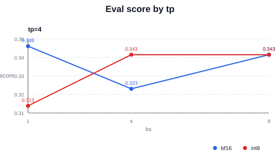
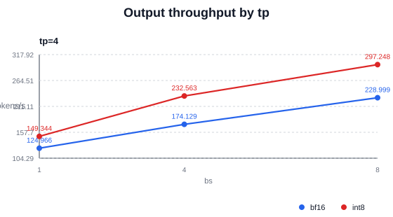
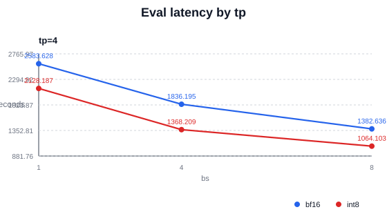
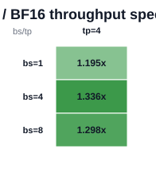
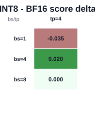

# LLaDA2 Eval INT8 Quant Benefit Report

- Source CSV: `/data/home/z84301856/proj_sglang/sglang_dllm_yuan/sglang-dllm/test/registered/dllm/results_bf16_int8_cannrecipeinfer_moeattn/flash_bf16_int8_quant_analysis_gpqa/llada2_flash_gpqa.csv`
- Matched bf16/int8 cases: 3

## Summary

- INT8 output throughput wins: 3/3
- Mean throughput speedup: 1.2762x
- Median throughput speedup: 1.2980x
- Mean latency speedup: 1.2851x
- Median latency speedup: 1.2993x
- Mean score delta: -0.0051
- Median score delta: +0.0000

## Charts

### Score by tp

### Output throughput by tp

### Latency by tp

### INT8 / BF16 throughput speedup

### INT8 - BF16 score delta

## Per-Case Table

| eval | bs | tp | bf16 score | int8 score | score delta | bf16 tok/s | int8 tok/s | speedup | bf16 latency s | int8 latency s |
| --- | ---: | ---: | ---: | ---: | ---: | ---: | ---: | ---: | ---: | ---: |
| gpqa | 1 | 4 | 0.3485 | 0.3131 | -0.0354 | 124.97 | 149.34 | 1.1951x | 2583.63 | 2128.19 |
| gpqa | 4 | 4 | 0.3232 | 0.3434 | +0.0202 | 174.13 | 232.56 | 1.3356x | 1836.20 | 1368.21 |
| gpqa | 8 | 4 | 0.3434 | 0.3434 | +0.0000 | 229.00 | 297.25 | 1.2980x | 1382.64 | 1064.10 |

## Notes

- `throughput_speedup = int8_output_throughput / bf16_output_throughput`.
- `latency_speedup = bf16_latency / int8_latency`; larger than 1 means INT8 is faster.
- GPQA/PIQA scores can move by one or more questions between runs; repeat key configs before treating small deltas as accuracy regressions.
