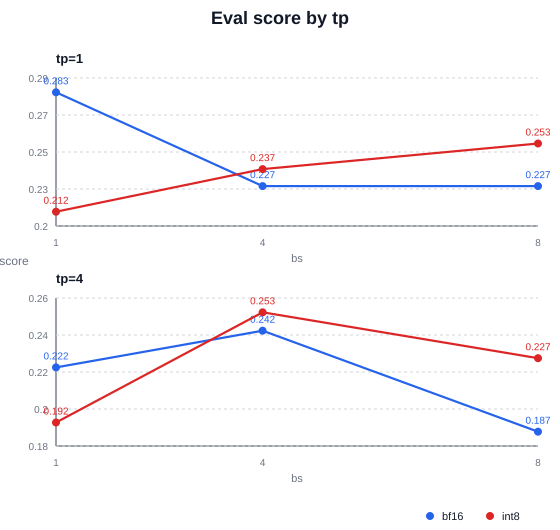
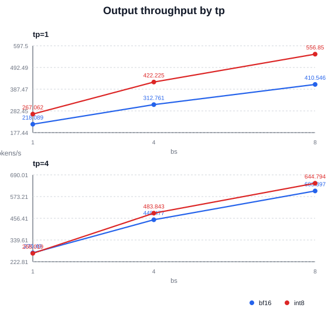
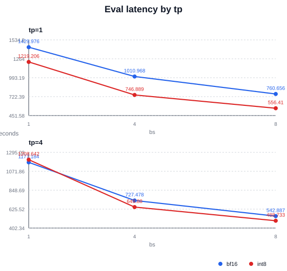
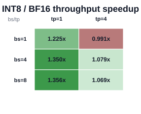
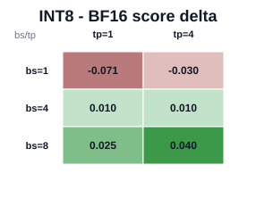

# LLaDA2 Eval INT8 Quant Benefit Report

- Source CSV: `/data/home/z84301856/proj_sglang/sglang_dllm_yuan/sglang-dllm/test/registered/dllm/results_bf16_int8_cannrecipeinfer_moeattn/mini_bf16_int8_quant_analysis_gpqa/llada2_mini_gpqa.csv`
- Matched bf16/int8 cases: 6

## Summary

- INT8 output throughput wins: 5/6
- Mean throughput speedup: 1.1782x
- Median throughput speedup: 1.1517x
- Mean latency speedup: 1.1830x
- Median latency speedup: 1.1461x
- Mean score delta: -0.0025
- Median score delta: +0.0101

## Charts

### Score by tp

### Output throughput by tp

### Latency by tp

### INT8 / BF16 throughput speedup

### INT8 - BF16 score delta

## Per-Case Table

| eval | bs | tp | bf16 score | int8 score | score delta | bf16 tok/s | int8 tok/s | speedup | bf16 latency s | int8 latency s |
| --- | ---: | ---: | ---: | ---: | ---: | ---: | ---: | ---: | ---: | ---: |
| gpqa | 1 | 1 | 0.2828 | 0.2121 | -0.0707 | 218.09 | 267.06 | 1.2246x | 1429.98 | 1219.21 |
| gpqa | 4 | 1 | 0.2273 | 0.2374 | +0.0101 | 312.76 | 422.22 | 1.3500x | 1010.97 | 746.89 |
| gpqa | 8 | 1 | 0.2273 | 0.2525 | +0.0253 | 410.55 | 556.85 | 1.3564x | 760.66 | 556.41 |
| gpqa | 1 | 4 | 0.2222 | 0.1919 | -0.0303 | 270.49 | 268.02 | 0.9909x | 1177.18 | 1208.64 |
| gpqa | 4 | 4 | 0.2424 | 0.2525 | +0.0101 | 448.48 | 483.84 | 1.0789x | 727.48 | 649.88 |
| gpqa | 8 | 4 | 0.1869 | 0.2273 | +0.0404 | 603.40 | 644.79 | 1.0686x | 542.89 | 488.73 |

## Notes

- `throughput_speedup = int8_output_throughput / bf16_output_throughput`.
- `latency_speedup = bf16_latency / int8_latency`; larger than 1 means INT8 is faster.
- GPQA/PIQA scores can move by one or more questions between runs; repeat key configs before treating small deltas as accuracy regressions.
