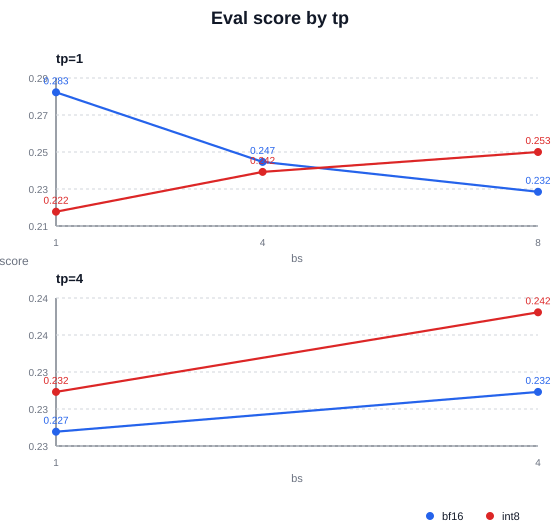
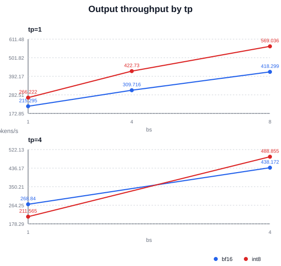
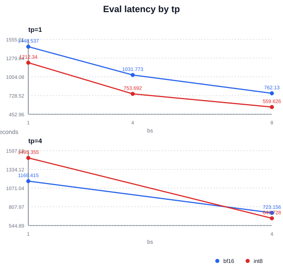
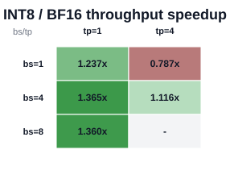
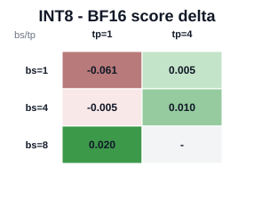

# LLaDA2 Eval INT8 Quant Benefit Report

- Source CSV: `/data/home/z84301856/proj_sglang/sglang_dllm_yuan/sglang-dllm/test/registered/dllm/results/mini_bf16_int8_quant_analysis_gpqa/llada2_mini_gpqa.csv`
- Matched bf16/int8 cases: 5

## Summary

- INT8 output throughput wins: 4/5
- Mean throughput speedup: 1.1729x
- Median throughput speedup: 1.2365x
- Mean latency speedup: 1.1652x
- Median latency speedup: 1.1948x
- Mean score delta: -0.0061
- Median score delta: +0.0051

## Charts

### Score by tp

### Output throughput by tp

### Latency by tp

### INT8 / BF16 throughput speedup

### INT8 - BF16 score delta

## Per-Case Table

| eval | bs | tp | bf16 score | int8 score | score delta | bf16 tok/s | int8 tok/s | speedup | bf16 latency s | int8 latency s |
| --- | ---: | ---: | ---: | ---: | ---: | ---: | ---: | ---: | ---: | ---: |
| gpqa | 1 | 1 | 0.2828 | 0.2222 | -0.0606 | 215.29 | 266.22 | 1.2365x | 1448.54 | 1212.34 |
| gpqa | 4 | 1 | 0.2475 | 0.2424 | -0.0051 | 309.72 | 422.73 | 1.3649x | 1031.77 | 753.69 |
| gpqa | 8 | 1 | 0.2323 | 0.2525 | +0.0202 | 418.30 | 569.04 | 1.3604x | 762.13 | 559.63 |
| gpqa | 1 | 4 | 0.2273 | 0.2323 | +0.0051 | 268.84 | 211.56 | 0.7870x | 1169.41 | 1495.35 |
| gpqa | 4 | 4 | 0.2323 | 0.2424 | +0.0101 | 438.17 | 488.85 | 1.1157x | 723.16 | 646.73 |

## Notes

- `throughput_speedup = int8_output_throughput / bf16_output_throughput`.
- `latency_speedup = bf16_latency / int8_latency`; larger than 1 means INT8 is faster.
- GPQA/PIQA scores can move by one or more questions between runs; repeat key configs before treating small deltas as accuracy regressions.
